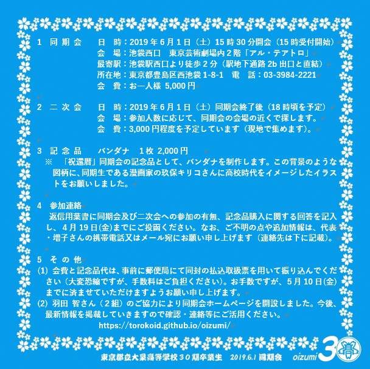

# oizumi
<html lang="ja">
 <head>
  <meta charset="utf-8" />
 

<link href="https://cdnjs.cloudflare.com/ajax/libs/lightbox2/2.7.1/css/lightbox.css" rel="stylesheet">
   
</head>
<body onload="alert('還暦まで、よく頑張りました！　第二の人生、始まり始まり〜〜(^o^)/')" onunload="alert('再会の時まで、元気でお過ごしくださいませ〜(^o^)/')">

<h1><marquee behavior="alternate">!!! 大泉高校、３０期同窓会HP !!!</marquee></h1>

<a href="https://torokoid.github.io/home">Home</a>>2019年同期会

	
<a href="https://torokoid.github.io/kanreki">本番画像リンク</a>
 

  モバイル端末をお使いの場合は、画面を横向きにするとより見やすくご覧頂けます。

 &nbsp;祝！還暦 

                              

 アクセス用QRコード

<marquee direction="right" scrollamount="20" width="30%">(^_^)/~hada</marquee>

<h2><marquee behavior="alternate">!!! 2019年6月1日、還暦祝い@池袋 !!!</marquee></h2>
<!--

-->

<h3> ～～～還暦祝いの日時通知～～～  
   
<section>
<h4>	★☆★☆★☆ 東京都立大泉高等学校30期卒業生　同期会準備委員会 ★☆★☆★☆  
　
代　表　　増子　悦夫（6組）　携帯電話　090-9132-4287 
　　　　　　　　　　メール　　eto_mas@yahoo.co.jp  
　田川　憲司（7組）　　　小椋　孝（8組） 
 
４月27日(土)時点参加人数 
1組12人、2組10人、3組8人、4組9人、5組7人、6組10人、7組21人、8組15人、9組14人、合計106人です。 
7組の21人は驚異的ですが、どのクラスもまんべんなくいるのでうれしい限りです。 
小椋 

</h4>
</section>

	<a href="http://alteatro.jp/access/" target="_blank"><h4>「アル・テアトロ」　アクセス</h4></a>
	<a href="https://torokoid.github.io/alteatoro"><h4>一時会会場、事前視察「アル・テアトロ」</h4></a>
	<a href="https://torokoid.github.io/jizou/"><h4>二次会会場、事前視察「大馬鹿地蔵」</h4></a>
 
<!--
<a href="https://tabelog.com/tokyo/A1305/A130501/13145399/party/" target="_blank">、　食べログリンク</a>
サラダ、パスタ、ピザなどで税込2,000円で２１人なので貸切です。 コーヒーを付けると＋300円です。
	  
-->

                    
<section>
<!-- begin wwww.htmlcommentbox.com -->
 
<a href="http://www.htmlcommentbox.com">HTML Comment Box</a> is loading comments...

 <link rel="stylesheet" type="text/css" href="//www.htmlcommentbox.com/static/skins/bootstrap/twitter-bootstrap.css?v=0" />
 
<!-- end www.htmlcommentbox.com -->
</section>

   
<section>
<!-- begin wwww.htmlcommentbox.com -->
 
<a href="http://www.htmlcommentbox.com">HTML Comment Box</a> is loading comments...

 <link rel="stylesheet" type="text/css" href="//www.htmlcommentbox.com/static/skins/bootstrap/twitter-bootstrap.css?v=0" />
 
<!-- end www.htmlcommentbox.com -->
</section>

      

<section>
<h2>部活関連リンク  
<a href="https://torokoid.github.io/ohizumi_soccer" target="_blank">サッカー部 ← リンクあり</a> 
<a href="https://torokoid.github.io/ooizumi_judo" target="_blank">柔道部　← リンクあり</a> 
<a>剣道部</a> 
<a>ボート部</a> 
<a>バスケ部</a> 
<a>テニス部</a> 
<a>バレー部</a> 
<a>卓球部</a>  
<a href="https://torokoid.github.io/hannari">雪路 はんなりの会　← リンクあり</a> 
<a href="https://torokoid.github.io/oizumi2010">同期会 2010 ← リンクあり</a> 
<a href="https://torokoid.github.io/izumikai">いずみ会 2010 ← リンクあり</a> 
<a href="https://torokoid.github.io/mascot/">体育祭マスコット写真、 ← リンクあり</a> 
<a href="https://torokoid.github.io/ensoku/">遠足の写真、 ← リンクあり</a> 

</h2>
 
</section> 

                             
<h2>
 <a href="https://torokoid.github.io/seisan-3/" target="_blank">会計計算、名前と金額の入力で割り勘計算が出来ます！</a>
	</h2> 

                    	

  

<!-- フッタ -->
 <footer>
 Copyright 2018/12/14 Pe-Young(S.Hada)
 </footer>
